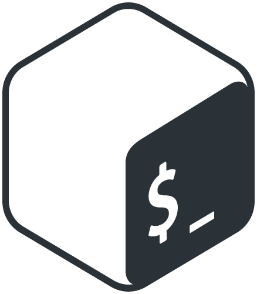

# Bash Logo
---The Bourne-Again Shell

Logo\
\
[[logo/jpg/monochrome_dark.jpg | width=100px | alt="Bash monochromed logo"]]\
[[logo/jpg/full_colored_dark.jpg | width=100px | alt="Bash dark coloured logo"]]\

Icon
 \
 \
 \

./logo:
jpg  png  svg

./logo/jpg:
full_colored_dark.jpg  full_colored_light.jpg  monochrome_dark.jpg

./logo/png:
full_colored_dark.png  full_colored_light.png  monochrome_dark.png

./logo/svg:
full_colored_dark.svg  full_colored_light.svg  monochrome_dark.svg

./symbol:
jpg  png  svg

./symbol/jpg:
full_colored_dark.jpg  full_colored_light.jpg  monochrome_dark.jpg  monochrome_light.jpg

./symbol/png:
full_colored_dark.png  full_colored_light.png  monochrome_dark.png  monochrome_light.png

./symbol/svg:
full_colored_dark.svg  full_colored_light.svg  monochrome_dark.svg  monochrome_light.svg

[Source] (https://bashlogo.com)
